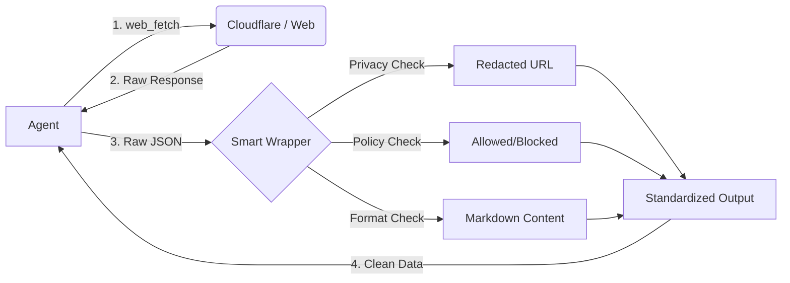

# Markdown Browser Skills (OpenClaw)

> **The "Smart Logic" Layer for OpenClaw's Native Fetch**


These skills act as a **Smart Wrapper** around OpenClaw's native `web_fetch`. It separates the *mechanism* of fetching (handled by OpenClaw's Rust engine) from the *policy* of data handling (handled by these skills).

## 🚀 Why Use This?

OpenClaw v2026.2.13 introduced native Markdown support, which is fast ("Ferrari Engine"). These skills add the safety features ("Volvo Seatbelt"):

1. **🛡️ Policy Enforcement**: Automatically parses `Content-Signal` headers. If a site says `ai-train=no`, we flag it immediately.
2. **🔒 Privacy Redaction**: Automatically detects and redacts sensitive keys/tokens from URLs before they enter your agent's context.
3. **🧩 Graceful Fallback**: Native fetch didn't get Markdown? No problem. We rely on `turndown` to convert the HTML fallback into clean Markdown. **Your agent always gets Markdown.**
4. **📦 Strict Normalization**: Outputs a standardized JSON schema, decoupling your agent logic from raw HTTP responses.

## 📦 Architecture



## 🛠️ Installation

Navigate to your OpenClaw skills directory:

```bash
cd ~/.openclaw/skills
git clone https://github.com/sarahmirrand001-oss/markdown-browser.git
cd markdown-browser
npm install --omit=dev
```

## 💻 Usage

These skills are designed to be used **after** a `web_fetch` call in your agent workflow.

### CLI Example

```bash
# 1. Save your web_fetch result to a file (e.g., input.json)
# 2. Run the wrapper
node browser.js \
  --input input.json \
  --content-signal "ai-input=yes, ai-train=no"
```

### Input Schema (`web_fetch` result)

```json
{
  "url": "https://example.com/api?token=SECRET",
  "finalUrl": "https://example.com/api?token=SECRET",
  "contentType": "text/html",
  "text": "<h1>Hello</h1>",
  "status": 200
}
```

### Output Schema

```json
{
  "content": "# Hello ", // Always Markdown
  "format": "html-fallback", // or "markdown" (native)
  "policy_action": "allow_input", // or "block_input"
  "source_url": "https://example.com/api?token=[redacted]",
  "fallback_used": true
}
```

## 🤝 Contribution

This project was refined through a collaboration between **Google Antigravity** and **Codex**. We believe in "Native Fetch + Smart Logic". Pull requests are welcome!
